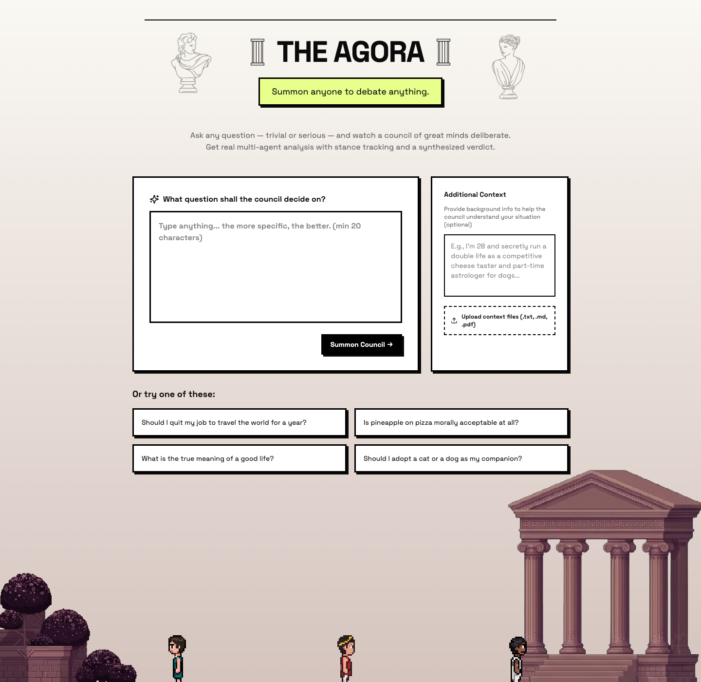

# The Agora

**Summon anyone to debate anything.**

Ask any question — trivial or profound — and watch a council of great minds deliberate. The Agora runs a multi-agent simulation where each persona is an independent LLM agent that forms opinions, takes stances, and argues from its own perspective. You get real stance tracking, round-by-round trajectory charts, and a synthesized verdict at the end.



## What it does

1. **Frame your question** — type anything from "should I quit my job?" to "is democracy just mob rule with better branding?"
2. **Select your council** — pick from a library of pre-built philosopher personas (Socrates, Diogenes, Aristotle, Seneca, Marcus Aurelius, Epicurus...) or describe any person, character, or archetype and the AI will expand it into a full debate persona. Or don't use AI and add them directly.
3. **Watch the debate** — personas take turns speaking in a live chat view, or switch to the **Arena** view to watch pixel-art sprites stand on terrain and deliver speeches with typewriter-style speech bubbles.
4. **Read the verdict** — a structured decision brief with a headline, stance summary, each voice's final position, and an opinion-over-time sparkline per persona.

## Stack

- **Frontend:** React + TypeScript + Vite + Tailwind 4, brutalist design system
- **Backend:** FastAPI + SQLAlchemy + Alembic, SQLite
- **Simulation runtime:** [CAMEL-AI OASIS](https://github.com/camel-ai/oasis) multi-agent framework
- **LLM providers:** Anthropic (Claude), OpenAI-compatible endpoints, or a local stub for development

## Run locally

### 1. Backend

```bash
# Create Python 3.11 environment
uv venv --python python3.11 .venv
source .venv/bin/activate
uv pip install -r backend/requirements.txt
```

Create a `.env` file in the repo root:

```bash
# Use the stub provider for local dev (no API key needed)
SIM_PROVIDER=stub
SIM_MODEL=stub

# Or use Anthropic
# SIM_PROVIDER=anthropic
# SIM_MODEL=claude-haiku-4-5-20251001
# SIM_API_KEY=sk-ant-...

# Or any OpenAI-compatible endpoint (Ollama, Together, etc.)
# SIM_PROVIDER=openai-compatible-model
# SIM_MODEL=llama3
# SIM_API_KEY=...
# SIM_BASE_URL=http://localhost:11434/v1
```

Start the server:

```bash
uvicorn backend.app.main:app --reload --host 127.0.0.1 --port 8000
```

### 2. Frontend

```bash
cd frontend
npm install
npm run dev
```

Open `http://localhost:5173`.

### 3. Fly.io (single-service deploy)

This repository ships with a one-service Fly setup that builds the frontend and serves it from FastAPI.

```bash
# create app (first time only)
fly launch --name agora --no-deploy

# create persistent volume for sqlite + uploads/simulations
fly volumes create agora-data --region iad --size 1

# deploy
fly deploy
```

Env defaults are configured in `fly.toml` for a stub provider. To use a real provider, run:

```bash
fly secrets set SIM_PROVIDER=anthropic SIM_MODEL=claude-haiku-4-5-20251001 SIM_API_KEY=your_key_here
```

If you want a Postgres-backed deployment later, we can migrate the app off SQLite and use a managed DB.

## API overview

| Endpoint | Description |
|---|---|
| `GET /api/personas` | List all available personas |
| `POST /api/personas/expand` | Expand natural language → full Persona via LLM |
| `POST /api/personas` | Create custom persona directly |
| `POST /api/documents` | Upload context document (.txt / .md / .pdf) |
| `POST /api/panel/recommend` | AI-recommended panel for a decision |
| `POST /api/sessions` | Start a new debate session |
| `GET /api/sessions/{id}` | Get current session snapshot |
| `POST /api/sessions/{id}/advance` | Run the next debate round |
| `POST /api/sessions/{id}/interjections` | Inject a user message mid-debate |
| `POST /api/sessions/{id}/finish` | End debate and generate verdict |
| `GET /api/sessions/{id}/events` | SSE stream of session events |

## Project structure

```
agora/
├── backend/
│   └── app/
│       ├── main.py           # All API routes
│       ├── models.py         # Pydantic request/response models
│       ├── entities.py       # SQLAlchemy ORM tables
│       ├── repository.py     # Data access layer
│       ├── services/         # Panel selection, persona expansion, documents
│       └── simulation/       # OASIS runtime, LLM provider abstraction, prompts
└── frontend/
    └── src/app/
        ├── pages/            # Home, SummonCouncil, Debate, Verdict
        ├── components/       # BrutalistButton, BrutalistCard, DebateArena, DesktopPet
        └── data/             # philosophers.ts (static persona definitions)
```

## Development tips

- Use `SIM_PROVIDER=stub` during UI work — no LLM calls, instant responses, zero cost.
- The Arena view uses pixel-art sprites from `public/pixelart/`. Each philosopher folder contains directional sprites (`rotations/south.png`, `east.png`, `west.png`).
- The frontend proxies API calls to `http://localhost:8000` via Vite config.
- Run backend tests: `pytest backend/tests -q`
- Build frontend: `npm run build` (from the `frontend/` directory)
