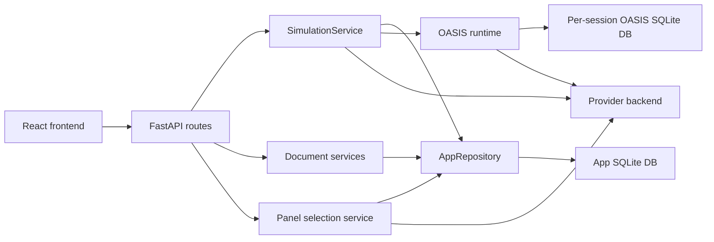
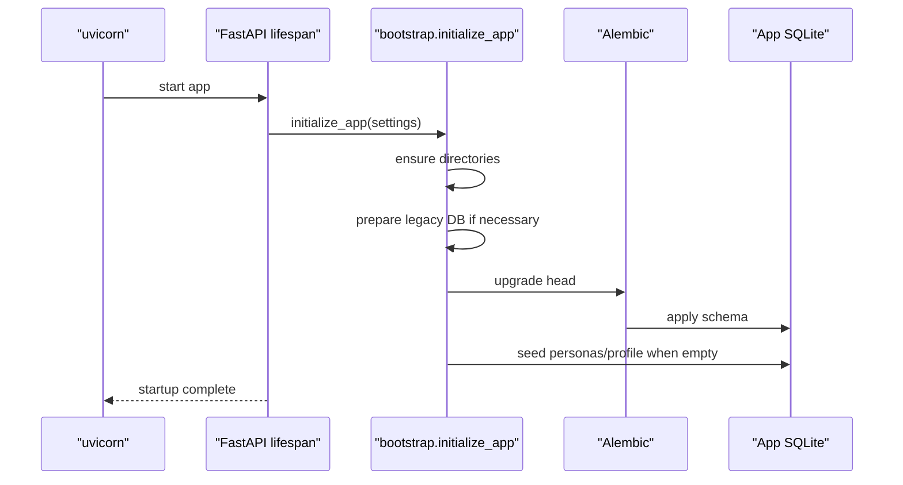
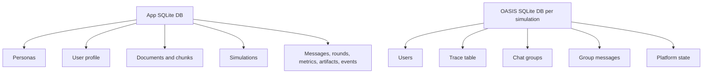
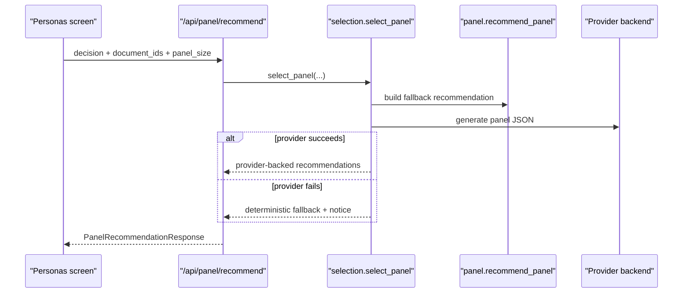
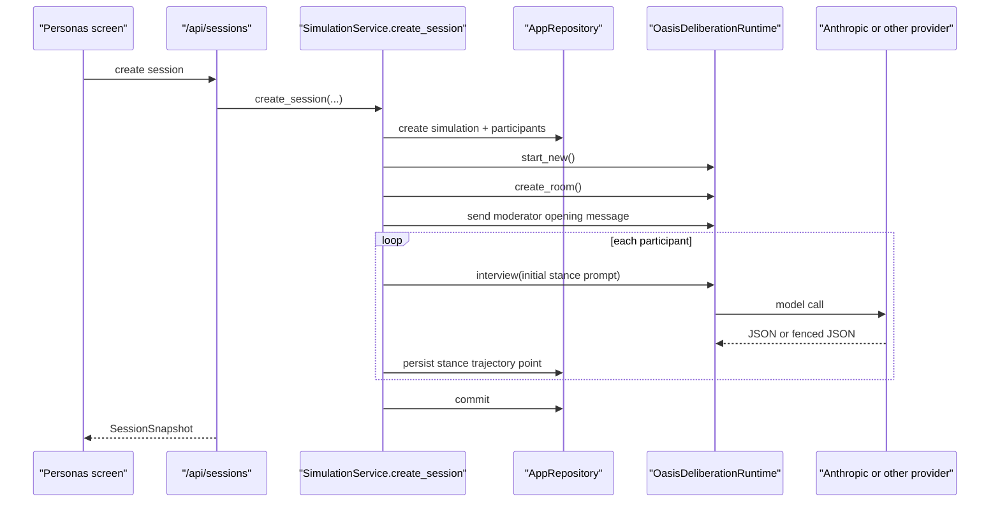
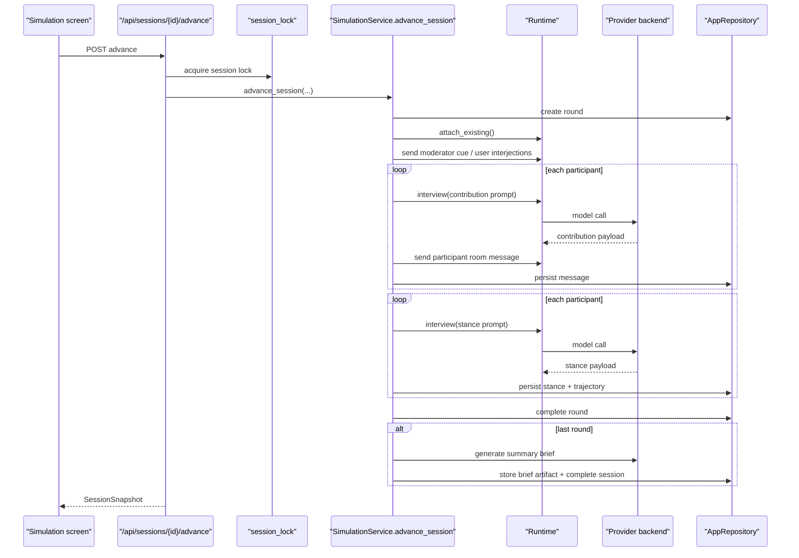
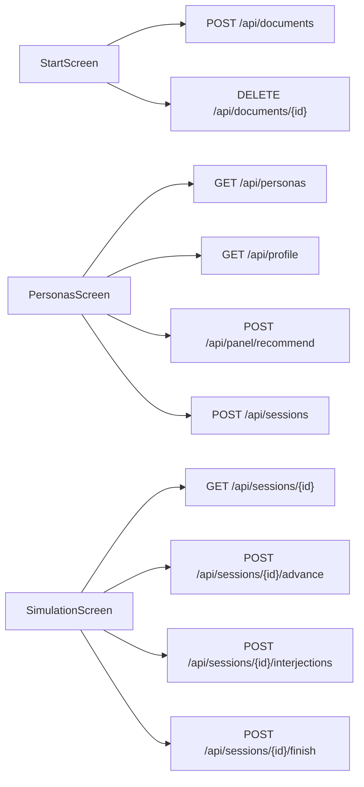

# Backend Architecture

This document describes how the current backend works, how it persists state, how it uses OASIS and Anthropic, and how it connects to the React frontend.

## Overview

The backend is a FastAPI application that preserves the original 3-step product flow:

1. Frame a decision and optionally upload documents.
2. Recommend and select a panel of personas.
3. Run a persisted multi-agent simulation and render a structured summary.

At a high level, the backend now has two kinds of persistence:

- App persistence in a SQLite database managed through SQLAlchemy and Alembic.
- Per-simulation OASIS trace databases stored as separate SQLite files under `backend/data/simulations/`.

The app uses a provider abstraction so the same code path can run with:

- `stub` for deterministic local testing.
- `anthropic` for real Claude-backed runs.
- `openai-compatible-model` for OpenAI-style endpoints.

## System Diagram



## Code Map

Core backend files:

- [main.py](/Users/matteoperona/Projects/agora/backend/app/main.py): FastAPI entrypoint, route wiring, lifespan setup, SSE endpoint, and session locking.
- [config.py](/Users/matteoperona/Projects/agora/backend/app/config.py): environment-driven settings loader.
- [bootstrap.py](/Users/matteoperona/Projects/agora/backend/app/bootstrap.py): directory creation, legacy DB handling, Alembic migration startup, and seed loading.
- [database.py](/Users/matteoperona/Projects/agora/backend/app/database.py): SQLAlchemy engine and session factory.
- [entities.py](/Users/matteoperona/Projects/agora/backend/app/entities.py): ORM entities for app persistence.
- [repository.py](/Users/matteoperona/Projects/agora/backend/app/repository.py): persistence abstraction for personas, documents, profiles, simulations, messages, metrics, artifacts, and events.
- [models.py](/Users/matteoperona/Projects/agora/backend/app/models.py): Pydantic request and response models shared by routes and services.
- [services/documents.py](/Users/matteoperona/Projects/agora/backend/app/services/documents.py): upload validation, extraction, chunking, and retrieval helpers.
- [services/selection.py](/Users/matteoperona/Projects/agora/backend/app/services/selection.py): provider-backed panel planner with deterministic fallback.
- [services/panel.py](/Users/matteoperona/Projects/agora/backend/app/services/panel.py): deterministic fallback heuristics, stance labels, and decision-frame extraction.
- [simulation/provider.py](/Users/matteoperona/Projects/agora/backend/app/simulation/provider.py): provider factory and robust JSON extraction from model outputs.
- [simulation/runtime.py](/Users/matteoperona/Projects/agora/backend/app/simulation/runtime.py): OASIS `AgentGraph`, `SocialAgent`, room creation, interviews, and group message plumbing.
- [simulation/service.py](/Users/matteoperona/Projects/agora/backend/app/simulation/service.py): the main simulation orchestration layer.
- [session_lock.py](/Users/matteoperona/Projects/agora/backend/app/session_lock.py): in-process per-session concurrency guard for `advance` and `finish`.

Schema and migrations:

- [alembic.ini](/Users/matteoperona/Projects/agora/backend/alembic.ini)
- [backend/alembic](/Users/matteoperona/Projects/agora/backend/alembic)

Backend tests:

- [backend/tests](/Users/matteoperona/Projects/agora/backend/tests)

## Startup Sequence

On backend startup, FastAPI runs the lifespan hook in [main.py](/Users/matteoperona/Projects/agora/backend/app/main.py), which calls `initialize_app()` from [bootstrap.py](/Users/matteoperona/Projects/agora/backend/app/bootstrap.py).

That startup sequence does four things:

1. Ensures upload and simulation directories exist.
2. Detects and backs up a legacy pre-Alembic SQLite DB if needed.
3. Runs Alembic migrations up to `head`.
4. Seeds personas and the single-user reasoning profile if the database is empty.

Sequence:



## Configuration

The backend reads settings from:

- the process environment
- the repo root `.env`

These are loaded by [config.py](/Users/matteoperona/Projects/agora/backend/app/config.py).

Important variables:

- `APP_DATABASE_URL`
- `UPLOADS_DIR`
- `SIMULATIONS_DIR`
- `SIM_PROVIDER`
- `SIM_MODEL`
- `SIM_API_KEY`
- `SIM_BASE_URL`
- `SIM_SELECTOR_MODEL`
- `SIM_SUMMARY_MODEL`
- `SIM_MAX_CONCURRENCY`

Provider behavior:

- `stub`: deterministic local model adapter for tests and smoke checks.
- `anthropic`: CAMEL Anthropic model backend.
- `openai-compatible-model`: CAMEL OpenAI-compatible backend using `SIM_BASE_URL`.

## Persistence Model

The app DB stores durable application state. The OASIS DB stores low-level social simulation traces.

App DB tables:

- `personas`
- `user_profiles`
- `documents`
- `document_chunks`
- `simulations`
- `simulation_participants`
- `simulation_rounds`
- `simulation_messages`
- `simulation_metrics`
- `simulation_artifacts`
- `simulation_events`

Per-simulation OASIS DB tables are created by OASIS itself and live in each simulation-specific SQLite file. Those include the social-platform tables for users, traces, chat groups, group messages, and related platform state.

Persistence split:



## Document Flow

Documents are uploaded synchronously through `/api/documents`.

Processing steps:

1. Validate extension and size.
2. Extract text from `.txt`, `.md`, or `.pdf`.
3. Normalize whitespace.
4. Save the original file into `UPLOADS_DIR`.
5. Chunk extracted text into overlapping segments.
6. Persist the document row and chunk rows in the app DB.

Document chunks are later re-selected for simulation rounds and summary generation using `select_relevant_document_chunks()`.

## Panel Recommendation Flow

The personas screen in the frontend automatically calls `/api/panel/recommend` after loading personas, profile, prompt, and attached documents.

The backend planner path:

1. Build a deterministic fallback recommendation using [panel.py](/Users/matteoperona/Projects/agora/backend/app/services/panel.py).
2. Attempt provider-backed selection through [selection.py](/Users/matteoperona/Projects/agora/backend/app/services/selection.py).
3. If provider construction or model generation fails, return the fallback recommendation with a `selection_notice`.

Sequence:



## Simulation Creation Flow

Creating a session through `/api/sessions` does not just create an in-memory object. It creates:

- a `simulations` row
- participant rows
- an OASIS SQLite DB for this session
- an OASIS chat room
- an opening system message
- initial stance interviews for every selected persona

Sequence:



## Round Advancement Flow

The simulation screen auto-runs by polling `/api/sessions/{id}/advance`. Each call:

1. Acquires the per-session lock.
2. Loads the simulation and attached documents.
3. Selects relevant document chunks for the current round.
4. Creates a round record and event.
5. Re-attaches the OASIS runtime to the existing per-session trace DB.
6. Injects any pending user interjections into the room.
7. Generates one contribution per persona.
8. Persists transcript messages and stance updates.
9. Marks the round complete.
10. If the round goal is reached, finalizes the brief atomically before returning.

Sequence:



## Finish Flow

`/api/sessions/{id}/finish` exists for manual early termination or explicit completion. It now uses the same finalization logic as the last round of `/advance`, which means:

- if a brief already exists, it returns the existing completed snapshot
- otherwise it generates the brief, persists it, marks the simulation complete, updates the user profile, and returns the finished snapshot

## Frontend Integration

The frontend communicates through [frontend/src/app/lib/api.ts](/Users/matteoperona/Projects/agora/frontend/src/app/lib/api.ts).

Current route mapping:

- `/`
  Uses:
  - `POST /api/documents`
  - `DELETE /api/documents/{id}`

- `/summon`
  Uses:
  - `GET /api/personas`
  - `POST /api/panel/recommend`
  - `POST /api/personas/random`
  - `POST /api/personas/expand`
  - `POST /api/personas`
  - `PATCH /api/personas/{id}`
  - `DELETE /api/personas/{id}`
  - `POST /api/sessions`

- `/debate/:debateId`
  Uses:
  - `POST /api/sessions/{id}/advance`
  - `POST /api/sessions/{id}/interjections`
  - `POST /api/sessions/{id}/finish`

- `/verdict/:debateId`
  Uses:
  - `GET /api/sessions/{id}`

There is also an additive SSE endpoint that the current frontend does not consume yet:

- `GET /api/sessions/{id}/events`

The current frontend does not depend on SSE yet; it still uses polling and route-based navigation.

Frontend-to-backend mapping:



## JSON Parsing Strategy

Real models do not reliably return raw JSON. Claude often wraps valid JSON in markdown fences or adds surrounding text.

To handle that, the backend now uses `_extract_json_payload()` in [provider.py](/Users/matteoperona/Projects/agora/backend/app/simulation/provider.py), which:

- tries fenced JSON blocks first
- then scans for the first balanced JSON object or array
- only validates with Pydantic after a JSON payload has been extracted

This parsing strategy is used for:

- provider-backed panel selection
- simulation initial stance interviews
- per-round contribution interviews
- per-round stance updates
- final brief synthesis

## Current Runtime Characteristics

What is synchronous from the frontend perspective:

- upload document
- get recommendations
- create session
- advance one round
- finish simulation

What is asynchronous internally:

- OASIS room operations
- provider model calls
- per-participant interviews
- brief synthesis

Expected behavior with a real provider:

- `POST /api/sessions` can take several seconds because it creates the room and interviews every selected persona before returning the first snapshot.
- `POST /api/sessions/{id}/advance` latency grows with persona count because each round includes multiple model calls.
- `POST /api/sessions/{id}/finish` is often slower than normal rounds because it runs summary generation.

## Known Caveats

These do not currently block the main flow, but they are worth knowing:

- OASIS prints `db_path ...` and `table user already exists` messages from its internal SQLite setup. This is noisy but not currently fatal.
- The CAMEL/OASIS dependency stack emits a `requests` compatibility warning in the venv.
- The OASIS `igraph` backend emits a deprecation warning about integer vertex names.
- Session documents are referenced by `document_ids` and re-read on later calls rather than snapshotted into immutable session-specific evidence blobs.
- The SSE endpoint exists, but the current frontend still relies on polling.

## Verification Commands

Backend health:

```bash
curl http://127.0.0.1:8000/health
```

Run the backend tests:

```bash
cd /Users/matteoperona/Projects/agora
source .venv/bin/activate
pytest backend/tests -q
```

Start the backend:

```bash
cd /Users/matteoperona/Projects/agora
source .venv/bin/activate
uvicorn backend.app.main:app --host 127.0.0.1 --port 8000
```

Start the frontend:

```bash
cd /Users/matteoperona/Projects/agora/frontend
npm run dev -- --host 127.0.0.1 --port 5173
```

## Recommended Reading Order

If you want to understand the backend from top to bottom, read in this order:

1. [main.py](/Users/matteoperona/Projects/agora/backend/app/main.py)
2. [config.py](/Users/matteoperona/Projects/agora/backend/app/config.py)
3. [bootstrap.py](/Users/matteoperona/Projects/agora/backend/app/bootstrap.py)
4. [repository.py](/Users/matteoperona/Projects/agora/backend/app/repository.py)
5. [simulation/service.py](/Users/matteoperona/Projects/agora/backend/app/simulation/service.py)
6. [simulation/runtime.py](/Users/matteoperona/Projects/agora/backend/app/simulation/runtime.py)
7. [simulation/provider.py](/Users/matteoperona/Projects/agora/backend/app/simulation/provider.py)
8. [services/selection.py](/Users/matteoperona/Projects/agora/backend/app/services/selection.py)
9. [services/documents.py](/Users/matteoperona/Projects/agora/backend/app/services/documents.py)
